# 서비스 - 도와주개냥🐾


## 목차

- [팀 소개](#팀-소개)

- [서비스 기획의도](#서비스-기획의도)

- [서비스 주요기능](#서비스-주요기능)

- [참고 데이터](#참고-데이터)

- [와이어 프레임](#와이어-프레임)

- [Git Convention](#Git-Convention)

- [Jira](#Jira)

- [실행방법(FE, DB, BE)](#실행방법)

- [CI/CD](#CI/CD)

- [실행화면](#실행-화면-일부)

  


## 팀 소개

| 구분 | 이름   | 개발 파트  |
| ---- | ------ | :--------: |
| 팀장 | 안영진 |   백엔드   |
| 팀원 | 김경석 |   백엔드   |
| 팀원 | 김중우 | 프론트엔드 |
| 팀원 | 송지호 | 프론트엔드 |
| 팀원 | 임건호 |   백엔드   |
| 팀원 | 장효정 | 프론트엔드 |

<hr>


## 서비스 기획의도

매년 증가하는 유기동물 발생 수 [지난해(2021) 유기동물 13만 마리… 21%는 안락사](https://futurechosun.com/archives/55827)<br/>
유기동물 조회및 정보 열람의 편의성을 높이며,<br/>
쉽고 간편하게 여러 사람들과 함께 유기동물 관리(봉사, 입양)에 참여할 수 있는 플랫폼을 개발

<hr>


## 서비스 주요기능

#### 유기동물 관련 데이터 제공 (동물 조회 / 데이터 시각화)

- 축종, 지역, 보호소 등 다양한 조건들로 보호중인 유기동물 조회 가능
- 2017년부터의 유기동물 관련 데이터를 분석해, 시각적인 정보로 제공

#### 보호소 관련 데이터 제공

- 지역별 보호소 정보 제공

#### 봉사 활동

- 유기동물 보호센터 관련 봉사 모집 글 게시 또는 참여 신청 가능

#### 커뮤니티

- 유기동물 관련 잡담, 제보, 후기 작성 가능
- 도와주개냥 굿즈 이벤트 참여 가능

#### 프로필 꾸미기

- 봉사활동 또는 입양 인증을 통해 다양한 뱃지 획득 또는 레벨업 가능

<hr>


## 참고 데이터

- 공공데이터 포탈에서 제공하는 농림축산식품부 농림축산검역본부\_동물보호관리시스템 유기동물 정보 조회 Open Api를 이용하였습니다.
- 공공데이터 포털에 없는 지역의 데이터는 각 지방자치단체 홈페이지의 데이터를 이용하였습니다.

---


## 와이어 프레임

- url: https://www.figma.com/file/CmLKh06fIyJd4xmydRdFs5/%EC%84%9C%EC%9A%B8-3%EB%B0%98-2%ED%8C%80?node-id=2%3A4

- 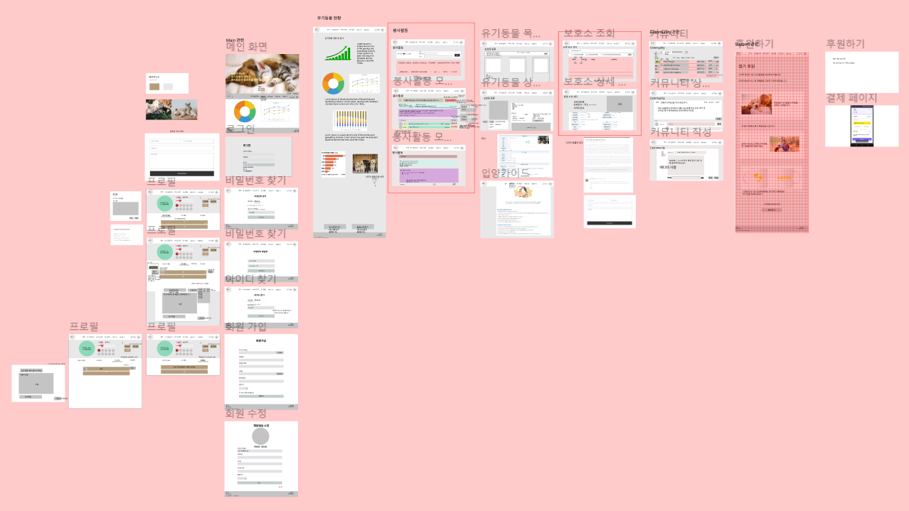

<hr>


## Git Convention

- Git 커밋 컨벤션

  ```shell
  $ git checkout -b 'branch-name'
  
  $ git checkout -b (front or back)/Add-Login-API/#3EWIAOVAIE
  
  $ git checkout -b develop:(front or back)/유형-기능요약/jira이슈번호
  	          |-----| 는 파고싶은 브랜치 이름
  
  $ git branch checkout -b front/feature-login-menu-component/#ASDWQ123
  		         |------------------------------------------| (브랜치 이름)
  $ git push 라고 치면 어떻게 쳐야하는지 알아서 알려줌
  
  $ git push origin front-feature/#ASDWQ123-login-menu-component
  		  |------------------------------------------| (브랜치 이름)
  
  /////////////////////////////////////////////////////////////////////////////////
  [보낼때]
  $ git add .
  
  $ git commit -m "#S06P12A202-80 Feat: Component 생성"
  
  $ git push origin develop:front/feature-nav-component/#S06P12A202-56
  
  $ git push origin develop:front/fest-home-funding-list/#S06P12A202-82
  
  [받을때]
  $ git pull origin develop
  ```

- branch-name 양식

  ```
  develop(front or back)/유형-기능요약/Jira 이슈번호
  ```


<hr>


## Jira

- Story 제목은 아래 형식으로 작성한다.
  ```text
  [BE: 댓글 등록] API 개발
  [FE: 댓글 등록] 게시글에 댓글 등록 기능 개발
  ```
  
- Labels는 대문자로 작성

- Labels에 업무 직무는 FRONTEND 또는 BACKEND로 작성

- Labels에 업무 형태는 Git 커밋 메세지와 동일(ex. FEAT, FIX, DOCS 등)   

<hr>


## 실행방법

- FE

  - 빌드

    ```shell
    cd frontend
    docker build -t frontend .
    ```

  - 실행

    ```shell
    docker ps -q --filter name=frontend | grep -q . && docker stop frontend && docker rm frontend
    docker run -d -p 80:80 -u root --name frontend frontend
    docker images -qf dangling=true | xargs -I{} docker rmi {}
    ```

- DB

  - 배포 전 작업

    ```shell
    mkdir /home/ubuntu/mysql
    docker pull mariadb
    ```

  - 배포

    ```shell
    docker ps -q --filter name=frontend | grep -q . && docker stop frontend && docker rm frontend
    docker run -v /home/ubuntu/mysql:/var/lib/mysql -d -it -p 3306:3306 -e MYSQL_ROOT_PASSWORD=root -e TZ=Asia/Seoul --name=mariadb mariadb
    ```

  - 스키마 및 계정확인

    ```shell
    docker exec -it mariadb /bin/bash
    mysql -u root -p
    use mysql;
    
    # a302 데이터베이스가 없는 경우 데이터베이스 생성이 필요합니다.
    SHOW DATABASES;
    CREATE DATABASE a302db DEFAULT CHARACTER SET utf8mb4 collate utf8mb4_general_ci
    
    
    # admin 계정 데이터가 없을 시에는 admin 계정을 생성하고 a302db에 접근권한이 필요합니다.
    use user, host from user;
    CREATE USER 'admin'@'%' IDENTIFIED BY 'ehdhkwnrosid';
    GRANT ALL PRIVILEGES ON a302db.* TO 'admin'@'%';
    ```

- BE

  - 배포 전 작업

    ```shell
    # 데이터베이스가 먼저 배포되어야 합니다.
    
    # 도커 볼륨 설정을 위해 아래 디렉터리를 생성합니다.
    mkdir -p /var/tmp/springboot/files/images/{badge,board,profile}
    
    # AWS corretto 11 JDK를 설치합니다.
    wget -O- https://apt.corretto.aws/corretto.key | sudo apt-key add - 
     sudo add-apt-repository 'deb https://apt.corretto.aws stable main'
    sudo apt-get update; sudo apt-get install -y java-11-amazon-corretto-jdk
    ```

  - 빌드

    ```shell
    cd backend
    chmod u+x ./gradlew
    ./gradlew build
    docker build -t backend .
    ```

  - 배포

    ```shell
    cd backend
    chmod u+x ./gradlew
    ./gradlew build
    docker build -t backend .
    ```

<hr>


## CI/CD

- Docker

  - BE

    ```dockerfile
    # Backend Dockerfile
    
    FROM amazoncorretto:11
    EXPOSE 8080
    ARG JAR_FILE=build/libs/a302-0.0.1-SNAPSHOT.jar
    COPY ${JAR_FILE} app.jar
    ENTRYPOINT ["java", "-jar", "/app.jar"]
    ```
    
  - FE
  
    ```dockerfile
    # Frontend Dockerfile
    
    FROM node:16.14.0 as builder
    
    RUN mkdir /usr/src/app
    WORKDIR /usr/src/app
    ENV PATH /usr/src/app/node_modules/.bin:$PATH
    COPY package.json /usr/src/app/package.json
    RUN npm install --silent
    
    COPY . /usr/src/app
    RUN npm run build
    
    FROM nginx:latest
    
    RUN rm -rf /etc/nginx/conf.d
    COPY conf /etc/nginx
    
    COPY --from=builder /usr/src/app/build /usr/share/nginx/html
    
    EXPOSE 80
    CMD ["nginx", "-g", "daemon off;"]
    ```
  
    
  
- Jenkins

  - Jenkinsfile

    ```
    pipeline {
        agent any
        
        environment {
            GIT_URL = "https://lab.ssafy.com/s06-bigdata-dist-sub2/S06P22A302.git"
        }
    
        tools {
            nodejs "nodejs"
        }
    
        stages {
            stage('Frontend Build') {
                steps {
                    sh 'docker build -t frontend ./frontend/'
                }
            }
    
            stage('Frontend Deploy') {
                steps {
                    sh 'docker ps -q --filter name=frontend | grep -q . && docker stop frontend && docker rm frontend'
                    sh 'docker run -d -p 80:80 -u root --name frontend frontend'
                }
            }
    
            stage('Frontend Finish') {
                steps{
                    sh 'docker images -qf dangling=true | xargs -I{} docker rmi {}'
                }
            }
    
            stage('Backend Build') {
                steps {
                    sh 'chmod u+x ./backend/gradlew'
                    dir('backend') {
                        sh 'sh ./gradlew build'
                    }
                    sh 'docker build -t backend ./backend/'
                }
            }
    
            stage('Backend Deploy') {
                steps {
                    sh 'docker ps -q --filter name=backend | grep -q . && docker stop backend && docker rm backend'
                    sh 'docker run -v /var/tmp/springboot/files:/var/tmp/springboot/files -d -it -p 8080:8080 --name backend backend'
                }
            }
    
            stage('Backend Finish') {
                steps{
                    sh 'docker images -qf dangling=true | xargs -I{} docker rmi {}'
                }
            }
        }
    }
    ```

<hr>


## 실행 화면 일부

### 1. 메인페이지

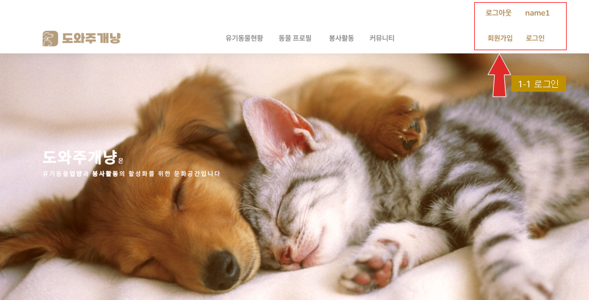


### 2. 회원관리

###  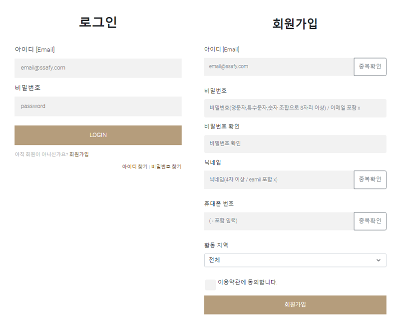


### 3. 유기동물현황 차트


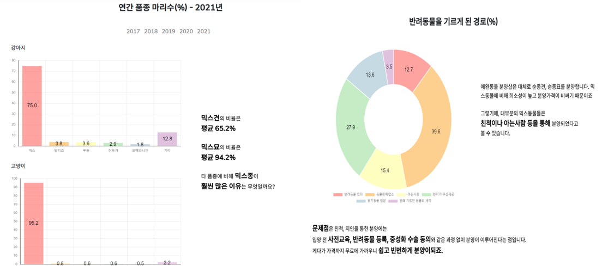

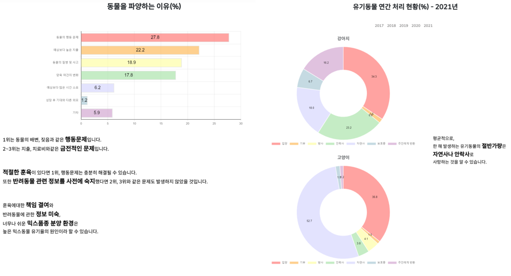

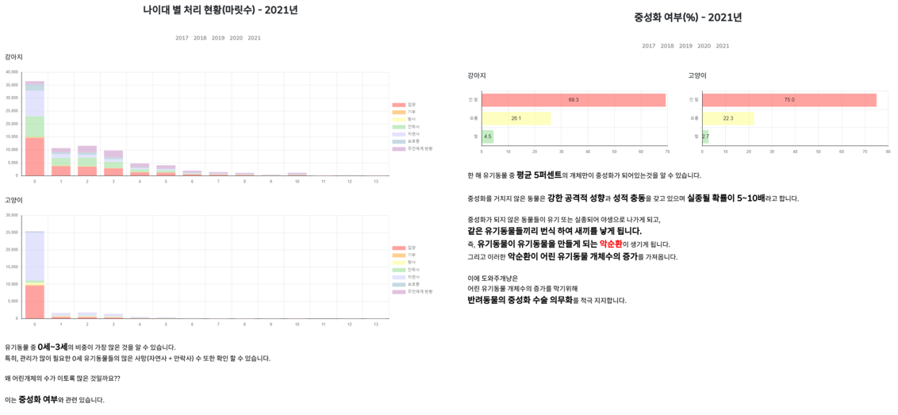


### 4. 커뮤니티

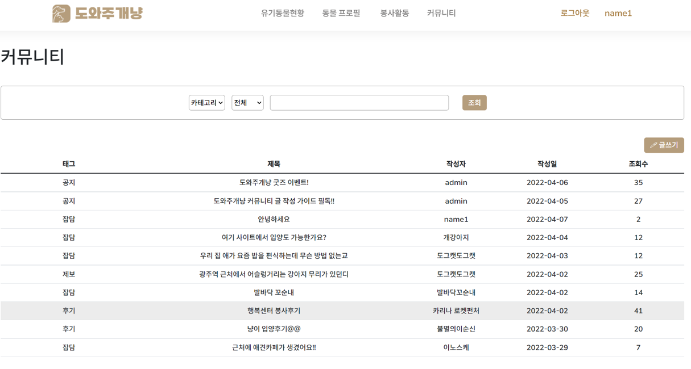

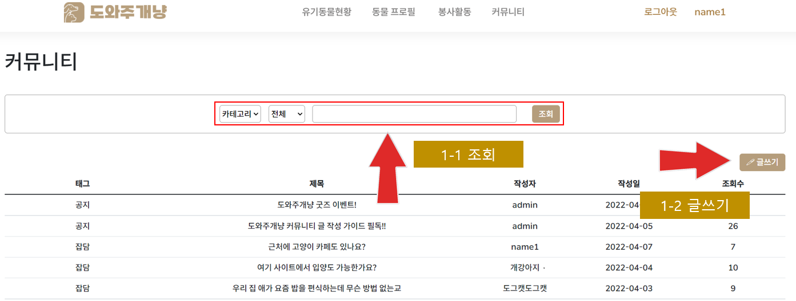


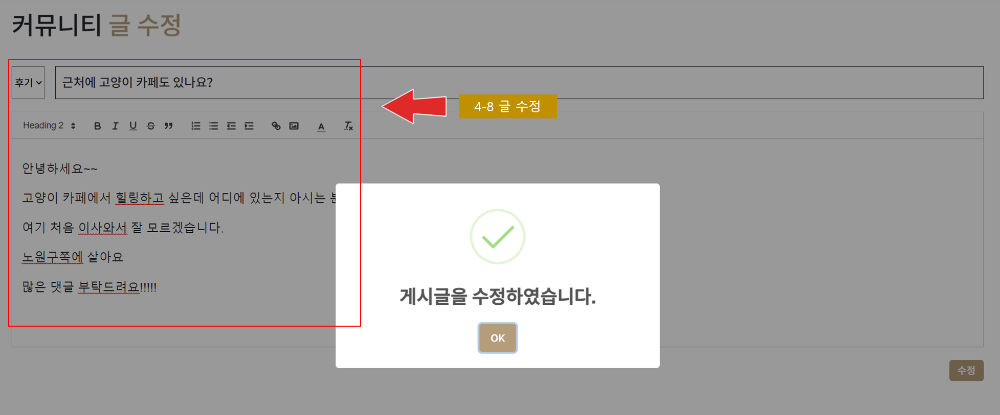


### 5. 프로필

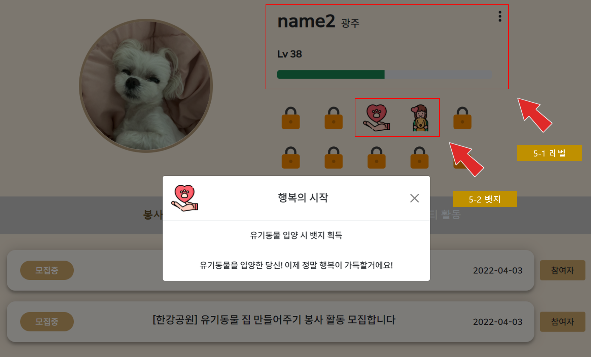

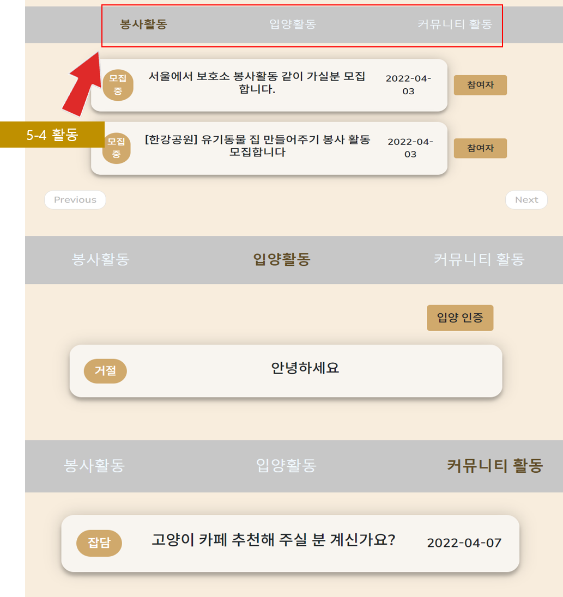


### 6. 봉사활동

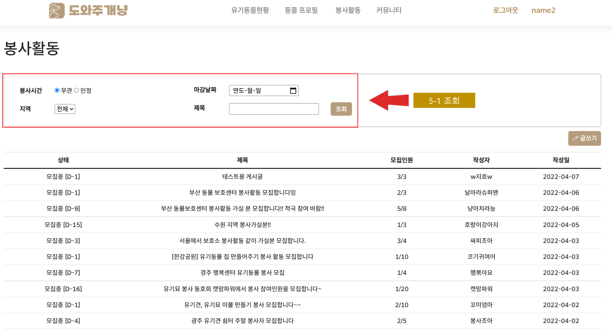

.png)


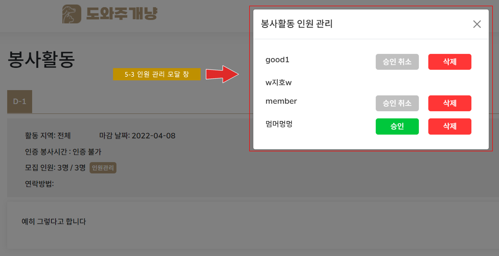

.png)


### 7. 유기동물

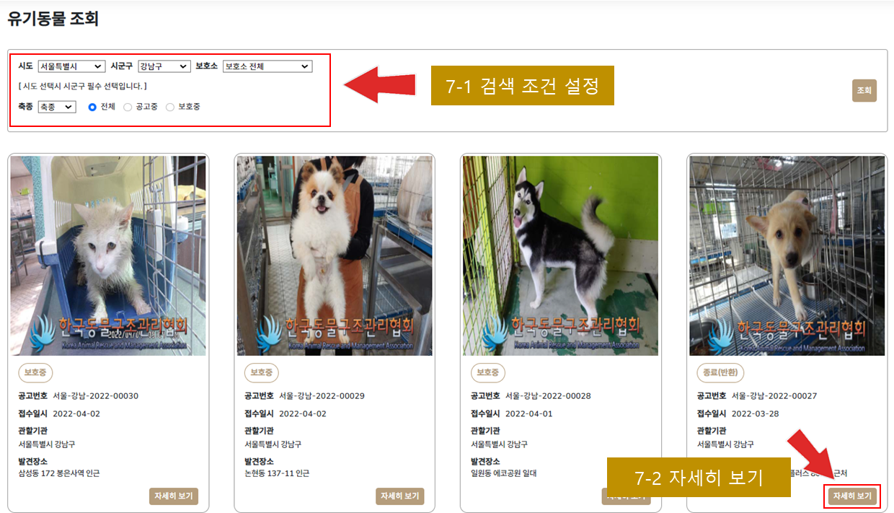

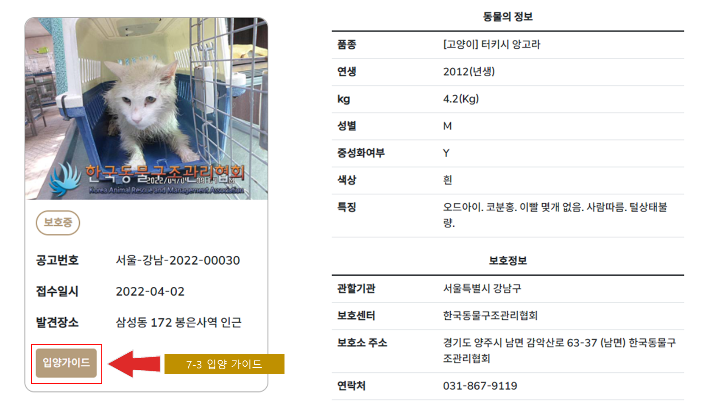

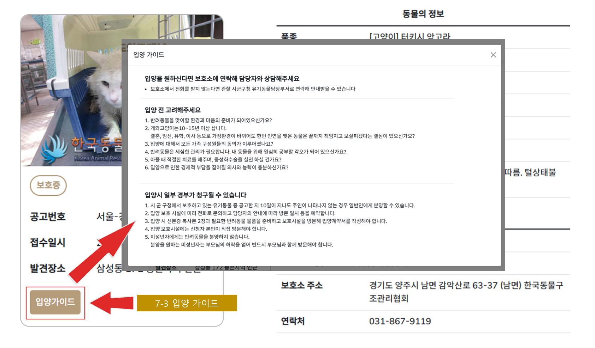


### 8. 보호소

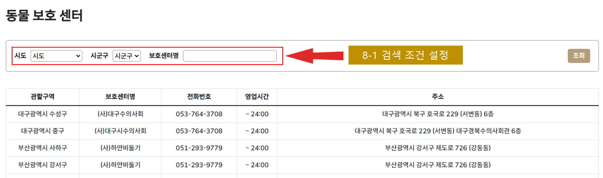

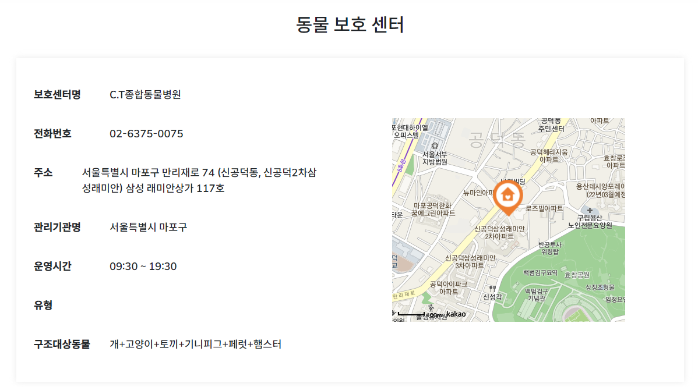
